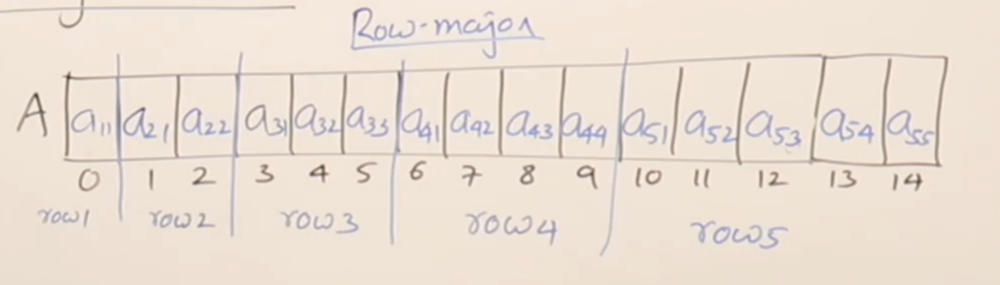
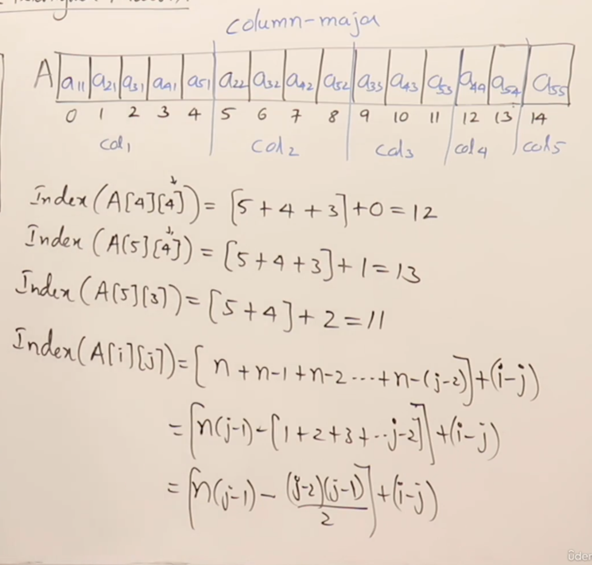

# Lower Triangular Matrix
    A type of square matrix where all the entries above the main diagonal are zero.
Example:
```matlab
1 0 0
2 3 0
4 5 6
```

Properties:
- matrix is square (number of rows = number of columns)

- matrix [i, j] = 0 for all i < j

- matrix [i, j] can be any value for all i >= j

- Number of non-zero elements in a lower triangular matrix is ```n (n+1) / 2```

- Number of zero elements in a lower triangular matrix is ```n^2 - n (n+1) / 2``` == ```n (n-1) / 2```

## Storage of Lower Triangular Matrix
1. Row Major Order: Store the non-zero elements row by row.
2. Column Major Order: Store the non-zero elements column by column.

### Row Major Order
- Store the non-zero elements row by row.
Formula for row major order:
    index (i, j) = i * (i - 1) / 2 + j - 1



### Column Major Order
- Store the non-zero elements column by column.
Formula for column major order:
    index (i, j) = [n (j - 1) - (j - 2) * (j - 1) / 2] + (i - j)



