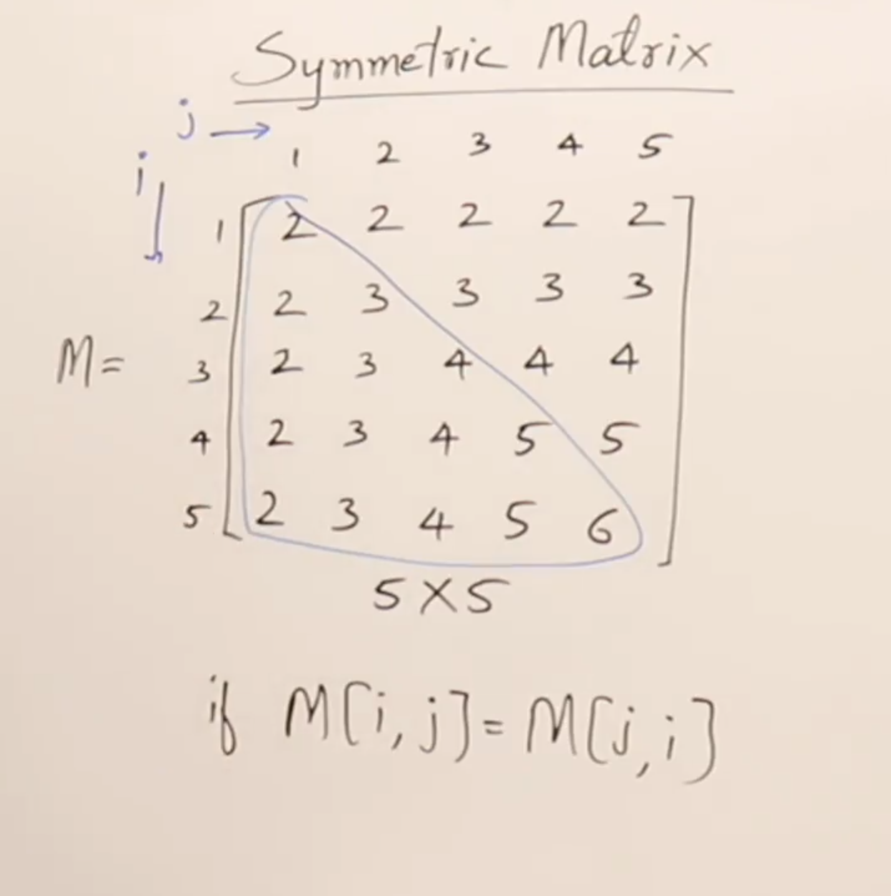

# Symmetric Matrix
matrix [i][j] = matrix [j][i] for all i, j

Example:

```m
2 2 2 2 2
2 3 3 3 3
2 3 4 4 4
2 3 4 5 5
2 3 4 5 6
```

- You can just store the upper triangular matrix or lower triangular matrix to save space.



