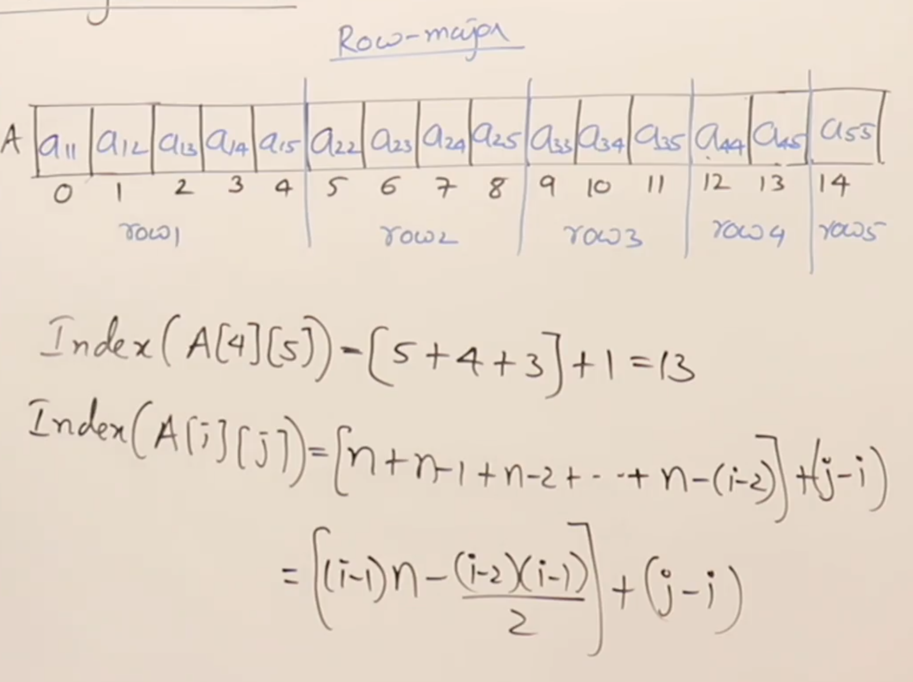
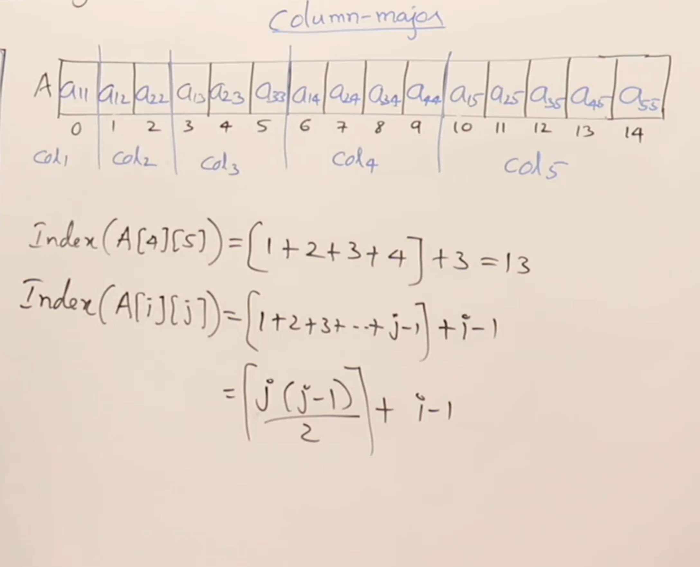

# Upper triangular Matrix

Example of an upper triangular matrix:

EX:-

```m
1 2 3
0 5 6
0 0 9
```

## Properties
- M is a square matrix
- M [i, j] = 0 for all i > j
- M [i, j] can be any value for all i ≤ j
- Number of non-zero elements in M is n(n+1)/2.
- Number of zero elements in M is n(n-1)/2.


## Storage of Upper Triangular Matrix
1. Row Major Order: Store the non-zero elements row by row.
2. Column Major Order: Store the non-zero elements column by column.

### Row Major Order
- Store the non-zero elements row by row. Formula for row major order: index (i, j) = [n * (i - 1) - (i - 2) * (i - 1) / 2] + (j - i)



### Column Major Order
- Store the non-zero elements column by column. Formula for column major order: index (i, j) = [j * (j - 1) / 2] + (i - 1)

